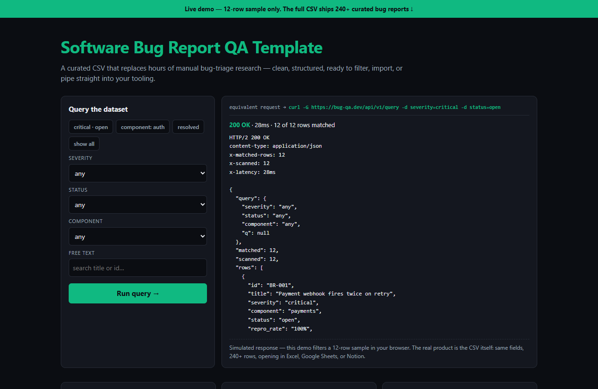

# Software Bug Report QA Template — live demo

  

  <a href="https://amos-mig.github.io/software-bug-report-qa-template-demo/"><strong>▶ Open the live demo</strong></a> ·
  <a href="https://amosmign.gumroad.com/l/software-bug-report-qa-template"><strong>Get the full product · €7</strong></a>

## What this is

An interactive, simulated query API over the Software Bug Report QA Template: filter a 12-row sample by severity, status, component, or free text and get a realistic JSON response — status line, headers, latency, and matched bug reports. Locked cards tease the full 240-row dataset and priority-score rubric, with a partial CSV preview below.

**Try it:** Pick severity=critical and status=open (or hit the 'critical · open' preset), run the query, and read the simulated JSON response showing only the matching bug reports.

## What you get in the full product

- Research done for you — save hours of manual collection
- Clean, consistent structure: sort, filter, and import anywhere
- Works in Excel, Google Sheets, Notion, and any CSV-compatible tool
- Practical fields chosen for real decision-making

## About

- **Storefront:** [kits.amosmignery.dev](https://kits.amosmignery.dev) — single-file products, instant download, commercial license
- **Checkout:** [Gumroad](https://amosmign.gumroad.com/l/software-bug-report-qa-template) (Merchant of Record, VAT handled)
- **Full product:** [Software Bug Report QA Template](https://amosmign.gumroad.com/l/software-bug-report-qa-template) · €7

## License

The demo page in this repo is MIT-licensed — reuse the technique, not the product.
The **Software Bug Report QA Template** itself is not included here and is not free software.
